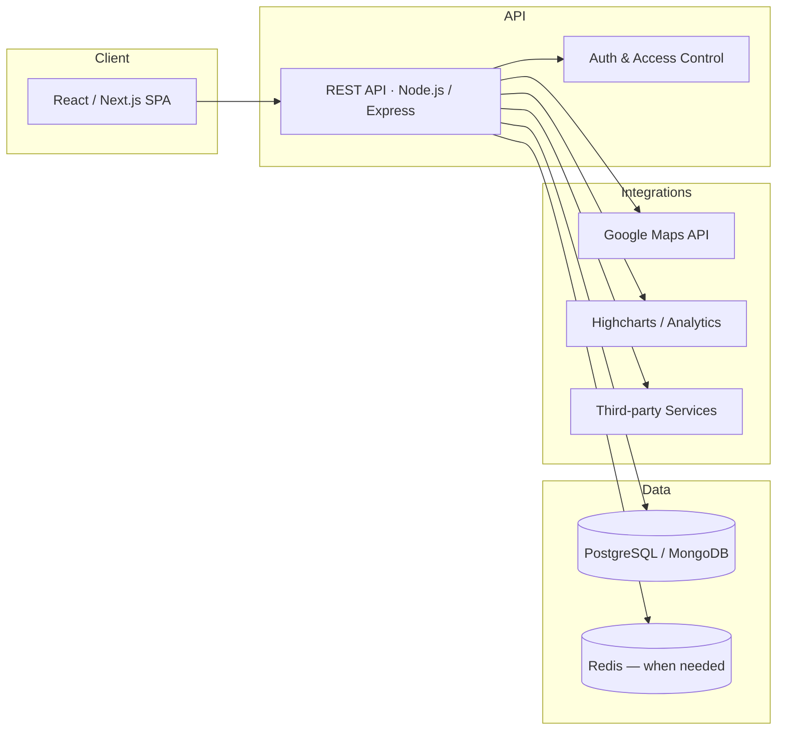

# Ahmad Zuliansyah Putra

**Senior Full Stack Engineer** · React · Node.js · TypeScript · Technical Lead

Building enterprise SaaS, mission-critical systems, and scalable full-stack products for distributed teams across **Australia**, the **United States**, **Vietnam**, and **Indonesia**.

🌐 **[Portfolio](https://portfolio-liard-psi-e27qzymkdy.vercel.app/)** · 💼 **[LinkedIn](https://linkedin.com/in/azputra)** · 📧 **[ahmadzp102@gmail.com](mailto:ahmadzp102@gmail.com)**

---

## Selected Impact

→ Led a **5-person** cross-functional team to recover and deliver a stalled **government monitoring platform** within **30 business days**

→ Built **healthcare compliance platforms** supporting hospital operational monitoring and waste management workflows

→ Designed **drag-and-drop content engines** enabling non-technical users to create interactive educational experiences

→ Delivered **facial recognition-based workforce management** and attendance systems for enterprise clients

→ Developed **no-code website builder** and warehouse management modules for a U.S.-based SaaS platform

---

## Featured Work

> Pin these repos on your profile for recruiter visibility. Private client work is summarized below.

| Project | Domain | Stack |
|---------|--------|-------|
| [**portfolio**](https://github.com/azputra/portfolio) | Interactive 3D portfolio · React + Three.js + GSAP | `React` `TypeScript` `Three.js` `WebGL` |
| **Government Vessel Monitoring** | Mission-critical maritime operations · dashboards & reporting | `React` `Node.js` `TypeScript` `PostgreSQL` |
| **Hospital Waste Management** | Healthcare compliance · operational monitoring | `React` `Node.js` `PostgreSQL` |
| **No-Code Website Builder** | U.S. SaaS · drag-and-drop page creation | `React` `Node.js` `TypeScript` |
| [**Edwardsog Playground**](https://playground.edwardsog.com) | Dyslexia-focused educational activity engine | `React` `JavaScript` |

---

## Architecture

Typical full-stack systems I design and deliver:

**Principles:** reusable component architecture · API-first design · performance optimization · remote-friendly delivery · production observability

---

## Tech Stack

**Core:** `React.js` `Next.js` `TypeScript` `Node.js` `Express` `REST APIs`

**Data:** `PostgreSQL` `MySQL` `MongoDB`

**Practices:** `System Architecture` `Technical Leadership` `SaaS Development` `Agile/Scrum` `Performance Optimization`

**Also:** `Three.js` `Highcharts` `Google Maps API` `Git` `Jira`

---

## Connect

| | |
|---|---|
| 🌐 Portfolio | [portfolio-liard-psi-e27qzymkdy.vercel.app](https://portfolio-liard-psi-e27qzymkdy.vercel.app/) |
| 💼 LinkedIn | [linkedin.com/in/azputra](https://linkedin.com/in/azputra) |
| ✍️ Medium | [medium.com/@azputra](https://medium.com/@azputra) |
| 📺 YouTube | [youtube.com/@azputra3658](https://www.youtube.com/@azputra3658) |
| 📧 Email | [ahmadzp102@gmail.com](mailto:ahmadzp102@gmail.com) |

📍 Indonesia · Remote · **English** (professional) · **Indonesian** (native)

---

Built with [Cursor](https://cursor.com) · [Referral link](https://cursor.com/referral?code=Y19PCLX43QLI)
